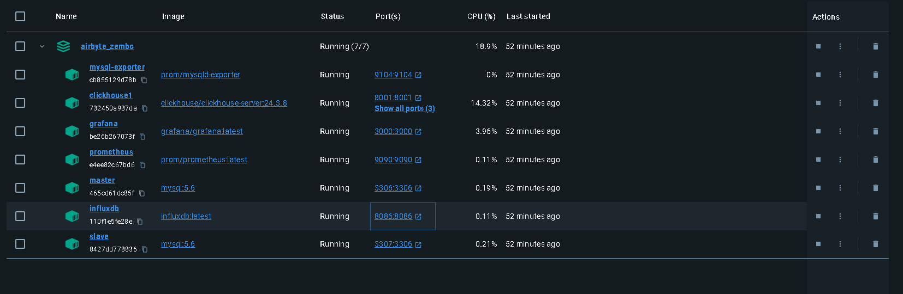
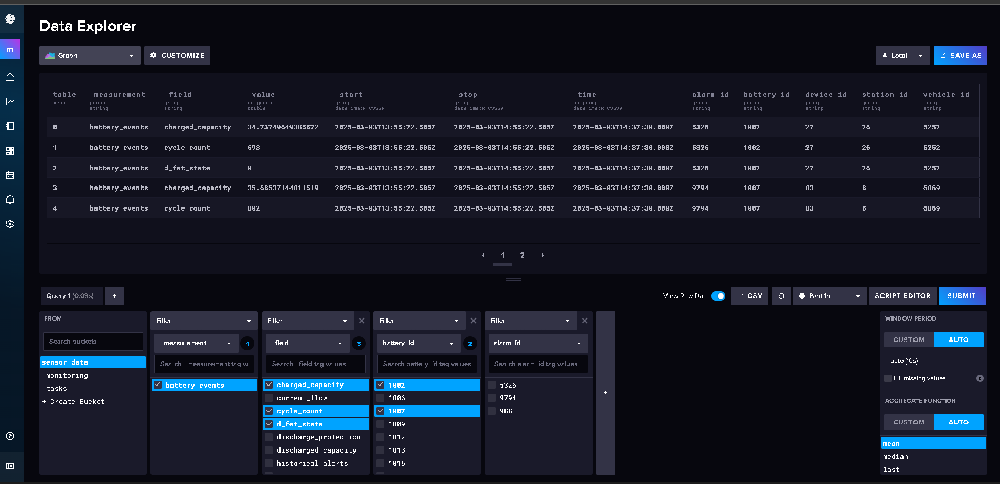
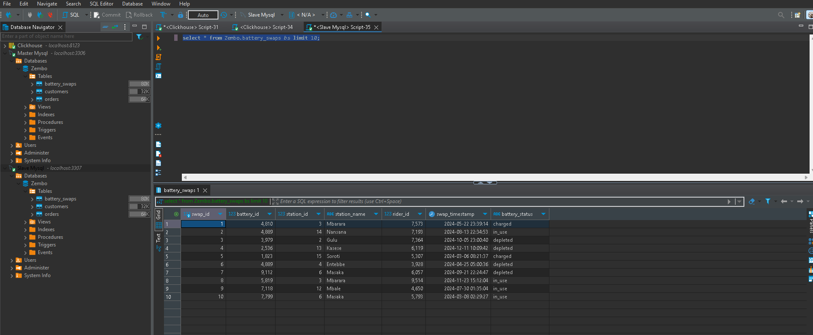
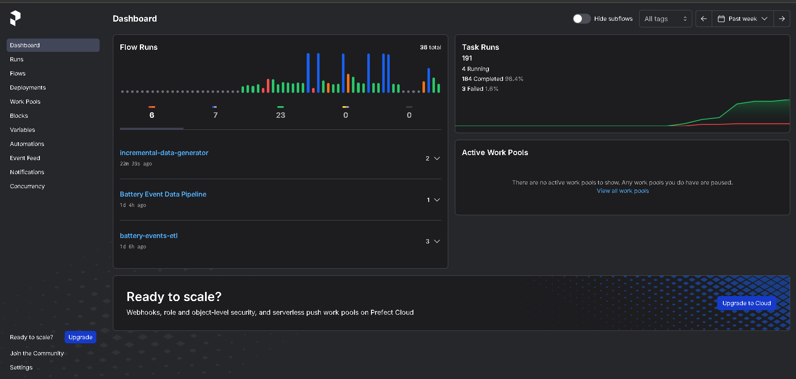
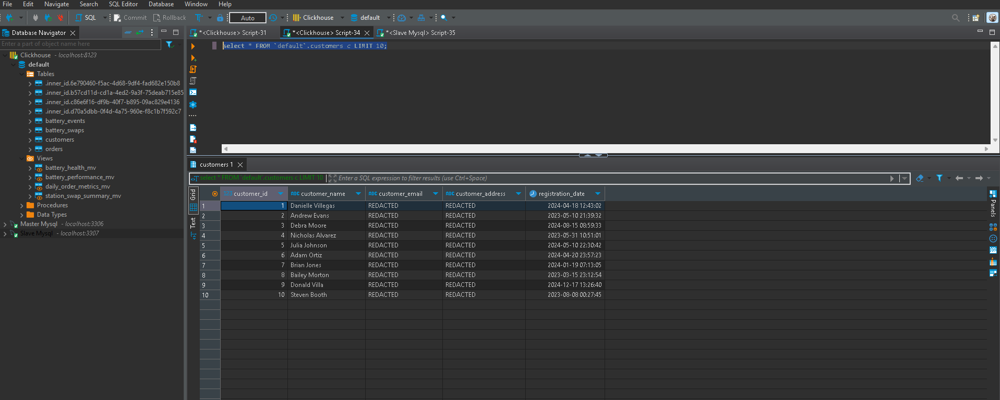
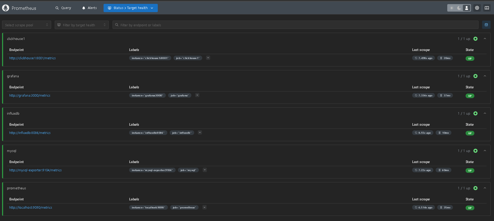
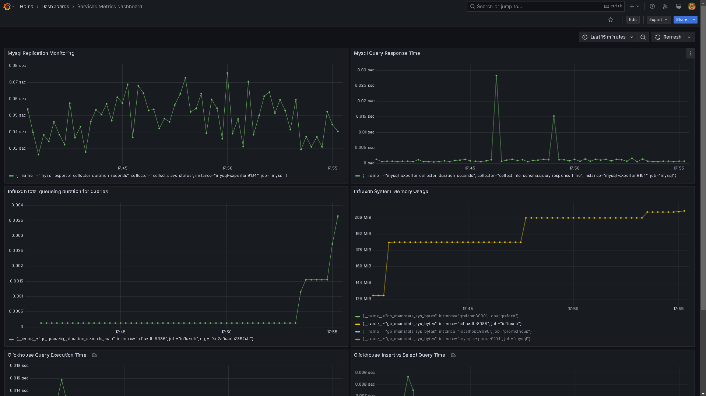
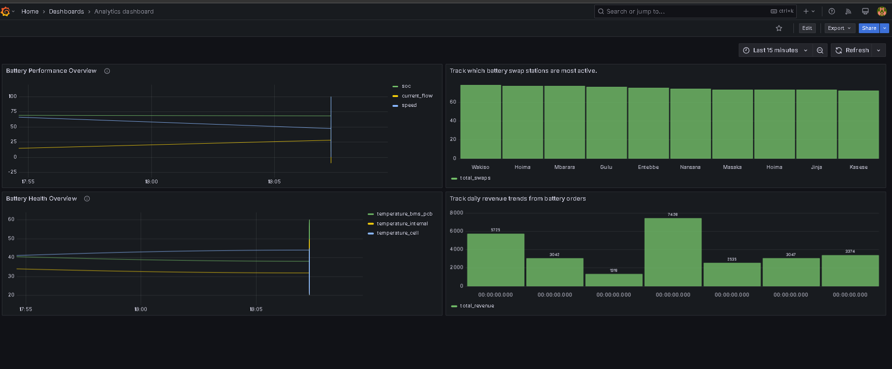

# **Zembo ETL Pipeline - GitHub Documentation**

## **Project Overview**
This repository contains an **end-to-end ETL pipeline** integrating MySQL, InfluxDB, and ClickHouse using **Prefect for data ingestion**, **Prefect for orchestration**, and **Prometheus & Grafana for monitoring**.

### **Key Features**
- **Data Sources:** MySQL (Master-Replica) & InfluxDB for IoT data.
- **Data Warehouse:** ClickHouse for analytical processing.
- **ETL Orchestration:** Prefect manages batch & incremental loads.
- **Monitoring:** Prometheus collects performance metrics.
- **Visualization:** Grafana dashboards provide real-time analytics.
- **Dockerized Setup:** Easily deployable with `docker-compose.yml`.

## **Project Structure**
```
airbyte_zembo/
│── clickhouse/
│   ├── node/
│   │   ├── config.xml
│   │   ├── users.xml
│── Data_generation_scripts/
│   ├── Influxdb_data_generator.py
│   ├── Mysql_data_generator.py
│── Data_validation_consistency/
│   ├── data_validation.py
│── influxdb_etl/
│   ├── battery_initial_etl.py
│   ├── incremental_battery_etl.py
│── mysql_etl/
│   ├── mysql_tables_initial_etl.py
│   ├── incremental_mysql_tables_etl.py
│── prometheus.yml
│── slave-db/
│── docker-compose.yml
│── requirements.txt
│── materialized_views.sql
```

## **Installation & Setup**
### **1️⃣ Prerequisites**
- **Python 3.10+**
- **Docker & Docker-Compose**
- **Prefect Installed**
- **ClickHouse Client**

### **2️⃣ Install Dependencies**
- To start create a python virtual environment
```bash
Python -m venv .venv

```

- Then activate the virtual environment on windows

```bash
 Source ./venv/Scripts/activate 
```

```bash
pip install -r requirements.txt

run: prefect server start 
```
- To start local prefect server
- Prefect server Ui on port **4200**.

### **3️⃣ Start the Fresh MySQL Setup**
```bash
docker-compose up -d
```
✅ **Expected Outcome:**
- Master MySQL starts on port **3307**.
- Slave MySQL starts on port **3308**.

Check if both are running:
```bash
docker ps
```

- **You should a running docker instance as such**



### **4️⃣ Configure the Master for Replication**
Log into the master:
```bash
docker exec -it master mysql -u root -p
```
Inside MySQL, run:
```sql
CREATE USER 'replica'@'%' IDENTIFIED BY 'replicapassword';
GRANT REPLICATION SLAVE ON *.* TO 'replica'@'%';
FLUSH PRIVILEGES;
```
✅ **Expected Outcome:** A new replica user is created for replication.

Next, check the binlog position:
```sql
SHOW MASTER STATUS;
```
📌 **Note the File and Position values** (e.g., `mysql-bin.000001`, Position `120`).

### **5️⃣ Configure the Slave to Follow the Master**
Log into the slave:
```bash
docker exec -it slave mysql -u root -p
```
Inside MySQL, run:
```sql
STOP SLAVE;

CHANGE MASTER TO
  MASTER_HOST='master',
  MASTER_USER='replica',
  MASTER_PASSWORD='replicapassword',
  MASTER_LOG_FILE='mysql-bin.000001',  -- Replace with the File from Step 4
  MASTER_LOG_POS=120;                  -- Replace with the Position from Step 4

START SLAVE;
```
✅ **Expected Outcome:** Slave starts following the master.

Check the replication status:
```sql
SHOW SLAVE STATUS\G;
```
Look for:
- **Slave_IO_Running: Yes**
- **Slave_SQL_Running: Yes**
- **Seconds_Behind_Master: 0** (if up to date)

### **6️⃣ Run the Data Generation Scripts**
```bash
python Data_generation_scripts/Influxdb_data_generator.py
python Data_generation_scripts/Mysql_data_generator.py
```
 - **Data on Influxdb**
 


 - **Data on Mysql/replica**

 - Sample data from battery_swaps on slave which is a replica of the master
 
### **7️⃣ Run the ETL Pipelines**
```bash
# Initial Load to ClickHouse
python influxdb_etl/battery_initial_etl.py
python mysql_etl/mysql_tables_initial_etl.py

# Incremental Data Loads
python influxdb_etl/incremental_battery_etl.py
python mysql_etl/incremental_mysql_tables_etl.py
```

- **Prefect monitoring tool for the pipelines**


### **8️⃣ Apply ClickHouse Materialized Views**
```bash
clickhouse-client --host=clickhouse-server --query="source materialized_views.sql"
```

- **Data on Clickhouse: same table that was on Mysql Replica**



### **9️⃣ Monitor Performance**
- **Access Prometheus:** `http://localhost:9090`
 - **Status for all services being monitored**


- **Access Grafana:** `http://localhost:3000`
- **Should be able to see something like this depending on the metrics you want to monitor**
- **Database metrics monitoring**




- **Analytics Dashboard**



---

## **Data Pipeline Workflow**
### **Data Flow**
1. **Data is inserted into MySQL Master and InfluxDB**.
2. **Prefect orchestrates ETL (initial + incremental loads).**
3. **Materialized Views are used for optimized queries.**
4. **Prometheus collects metrics, Grafana visualizes analytics.**


---

## **Challenges & Considerations**
### **1️⃣ Challenges Faced**
- **Debezium & Kafka were too complex**, so Airbyte was chosen for simplicity.
- **Prefect in Docker had issues**, so it runs locally for now.
- **Data duplication risks solved** with incremental timestamp-based ingestion.

### **2️⃣ Future Improvements**
1. Move to **Airbyte for CDC-based** loads.
2. Airbyte with a **low sync frequency**
3. Optimize **materialized view** refresh.
4. **ClickHouse optimizations** for performance.
5. Explore use of **kafka application**.


---

## **Contributing**
### **How to Contribute**
- Fork the repository
- Create a feature branch (`git checkout -b feature-new`)
- Commit your changes (`git commit -m "Added new ETL script"`)
- Push to GitHub (`git push origin feature-new`)
- Open a Pull Request

---

## **License**
This project is licensed under the MIT License.

